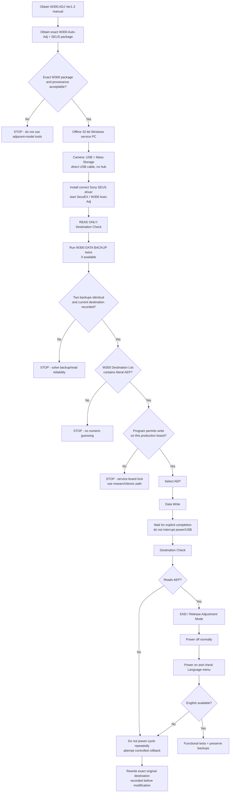

# Sony DSC‑W300 Japanese-to-English Service Conversion: Resources, Procedure, Rollback, and Recovery

## Executive summary

There is strong primary-source evidence that the Sony DSC‑W300 stores a programmable **destination setting** on its SY‑199 main board and that Sony service technicians were instructed to restore that setting with a procedure called **`DESTINATION DATA WRITE`**. Sony's DSC‑W300 Level‑2 service manual explicitly says that when the SY‑199 board is replaced, technicians must refer to the separate ADJ service manual and perform `DESTINATION DATA WRITE`; it separately requires `USB SERIAL No. INPUT` after board replacement. citeturn18view2turn17view0

The most important discovery is that the exact W300 adjustment manual really exists: **`SONY DSC-W300 ADJUSTMENT VER1.3`**, 37 pages, approximately 805 KB, indexed at Elektrotanya as `sony_dsc-w300_adjustment_ver1.3.pdf`. An earlier **Ver.1.2** is also indexed. citeturn19search3turn15search0 The W300 Level‑2 and Level‑3 service manuals are also available independently. citeturn16search6turn7search6

However, one critical component remains missing from publicly verifiable sources: **I did not find a trustworthy download of the actual W300 Automatic Adjustment executable and its W300-specific service-data payload**. I also did not find a verifiable, separately versioned distribution of `SeusEX`, `Sony Seus USB Driver`, or `WriteEnableTool.exe` tied specifically to the DSC‑W300. The W300 service manual proves those names and the SEUS workflow, but does not state their file versions. citeturn18view0 This is the principal reason I do **not** recommend taking a stock Japanese W300 and immediately writing to it with a tool obtained from an arbitrary repair-software archive.

There is a second, potentially decisive issue. Sony's **same-generation DSC‑H50 ADJ manual**, whose service architecture is almost identical in this respect, says that `DESTINATION DATA WRITE` **cannot be performed on anything other than the Service board**. Its GUI nevertheless contains a Destination List, `Data Write`, and `Destination Check`, and its documented sequence is exactly the sort of operation the W300 service manual references. citeturn26view0 The inaccessible W300 ADJ PDF may contain the same production-board restriction. Therefore, it is not yet established that Sony's official W300 Auto‑Adj program will permit a destination rewrite on your original retail Japanese SY‑199 board.

For your camera, the target should be the **literal `AEP` destination presented by the W300 adjustment program, if and only if the W300 program offers it**. The W300 service manual explicitly covers an AEP model, and Sony's European W300 specification lists English, Polish, and numerous other European menu languages. citeturn17view0turn3search1 I found no defensible source for a hidden numeric W300 destination byte or numeric “AEP ID”; copying an address or destination number from an H50, W170, T300, or another Cyber-shot would be unsafe.

**My recommended path is therefore staged rather than a blind flash:**

1. Obtain the W300 **ADJUSTMENT VER1.3 manual**.
2. Obtain an **exact W300 Auto‑Adj package**, not a neighboring-model executable.
3. Run it on an isolated 32-bit Windows XP environment.
4. Perform only **Destination Check / Data Backup** first.
5. Record the original Japanese destination exactly.
6. Verify that the W300 program itself offers `AEP`.
7. Verify that it accepts your existing production board rather than requiring a blank/service SY‑199.
8. Only then execute `Data Write`.
9. Re-read destination immediately, power-cycle, and verify English.
10. If any prerequisite fails, **stop rather than improvise with raw register writes**.

I rate the approaches as follows:

| Approach | Chance of achieving English | Brick risk | Current recommendation |
|---|---:|---:|---|
| Exact W300 Auto‑Adj / Destination Data Write | High **if** retail-board writing is allowed | Low–moderate | **Preferred, but gated on obtaining exact software** |
| W300 Auto‑Adj against production board if service-board check blocks it | Low without further reverse engineering | Moderate–high if bypassed | **Stop at read-only stage** |
| PMCA reconnaissance | Low–unknown for this 2008 camera | Low if reconnaissance only | Useful secondary experiment |
| Known-good AEP SY‑199 donor board | High for language | Moderate mechanical/calibration risk | Best hardware fallback |
| Compare JDM/AEP service backups and patch destination bytes | Potentially high | High until format/checksum known | Advanced research route |
| Blind EEPROM/NAND hex edit | Unknown | **Very high** | **Do not do** |
| Flash another model's Auto‑Adj/service data | Unknown | **Very high** | **Do not do** |

A further correction to the usual online advice is important: **`WriteEnableTool.exe` is not documented by Sony as the mechanism that performs Destination Data Write.** In the W300 Level‑2 manual it is specifically used to temporarily permit PC writes into the camera's normally protected **internal image-memory filesystem**. Sony's procedure is: Mass Storage → Sony Seus USB Driver → launch Write Enable Tool and `SeusEX` → `Activate Write Enable Mode`; after the filesystem write, turn the camera off, which clears the write-enable state. citeturn18view0 Destination Data Write is a separate ADJ operation. Do not press `Activate Write Enable Mode` merely because you are changing destination data unless the W300 ADJ package itself instructs you to do so.

## Evidence and exact resource inventory

The distinction between Sony-authored material and third-party hosting matters here. ManualsLib and Elektrotanya are not Sony, but the PDFs they expose are Sony EMCS service documents with Sony document identifiers, model coverage, revision histories, and contemporaneous service terminology. Wherever possible, I cross-checked them against Sony's own consumer manuals and specifications. citeturn17view0turn19search4

### Resource table

| Resource | Exact identification | Location | What is verified | Use / recommendation |
|---|---|---|---|---|
| **DSC‑W300 Level‑2 Service Manual** | `DSC-W300_L2`, Ver. 1.1, 2008.05, Sony EMCS, **9-852-287-31** | `https://www.manualslib.com/manual/767486/Sony-Dsc-W300.html` | W300, SY‑199, AEP/Japanese models, Destination Data Write requirement, SEUS/WriteEnable names. citeturn17view0turn18view2 | **Essential** |
| **DSC‑W300 Level‑2 Ver.1.2** | `sony_dsc-w300_level2_ver1.2_sm.pdf` | `https://elektrotanya.com/sony_dsc-w300_level2_ver1.2_sm.pdf/download.html` | Indexed archive copy of later Level‑2 revision. citeturn16search6 | Prefer as later revision; retain v1.1 for cross-check |
| **DSC‑W300 Level‑3 Ver.1.1** | `sony_dsc-w300_level3_ver1.1.pdf` | `https://elektrotanya.com/sony_dsc-w300_level3_ver1.1.pdf/download.html` | Indexed Level‑3 schematic/manual. citeturn7search6 | **Essential before hardware NVM work** |
| **DSC‑W300 Adjustment Ver.1.3** | `sony_dsc-w300_adjustment_ver1.3.pdf`, `SONY DSC-W300 ADJUSTMENT VER1.3`, ~805.4 KB, 37 pages | `https://elektrotanya.com/sony_dsc-w300_adjustment_ver1.3.pdf/download.html` | Exact model and revision are indexed. citeturn19search3 | **Highest-priority document** |
| **DSC‑W300 Adjustment Ver.1.2** | `sony_dsc-w300_adjustment_ver1.2.pdf` | `https://elektrotanya.com/sony_dsc-w300_adjustment_ver1.2.pdf/download.html` | Earlier revision indexed in search. citeturn15search0 | Secondary/reference |
| **W300 supplemental adjustment document** | Search-indexed as `SONY DSC-W300 SUPP. ADJUSTMENT VER1.0` | Elektrotanya search/catalog; exact landing URL was not independently retrievable | Existence surfaced in archive index, but I could not verify its direct file URL | Obtain if possible; may explain changes between Auto‑Adj revisions |
| **W300 Auto‑Adj executable** | **Exact filename/version not recovered** | No trustworthy public copy found in this investigation | Sony's ADJ ecosystem clearly used model-specific Auto‑Adj EXEs, but the exact W300 executable is not presently verified | **Missing gating artifact—do not substitute another model** |
| **`SeusEX`** | `SeusEX` / likely executable `SeusEX.exe` | No verified standalone W300 distribution located | Name and use are explicitly stated in Sony service documentation. citeturn18view0 | Required by historical service environment; exact W300-compatible version unresolved |
| **Sony SEUS USB driver** | Display name **`Sony Seus USB Driver`** | No authenticated standalone W300 package located | Sony W300 manual expressly instructs technicians to switch to this driver. citeturn18view0 | Required for Sony service workflow; exact INF/package revision unresolved |
| **Write Enable Tool** | **`WriteEnableTool.exe`** | No authenticated standalone W300 distribution located | Exact filename is given by Sony. citeturn18view0 | Internal-memory tool; **not independently established as part of destination write** |
| **Official W300 Handbook** | `W300_hb_GB.pdf` | `https://www.sony.jp/cyber-shot/emdown/data/W300_hb_GB.pdf` | Mass Storage USB, internal memory, Memory Stick Duo, supported media, Windows-era workflow. citeturn19search4 | Essential user-side reference |
| **Official Sony W300 downloads** | Current DSC‑W300 support page | `https://www.sony.com/electronics/support/compact-cameras-dsc-w-series/dsc-w300/downloads` | No consumer W300 firmware updater is offered; present download is essentially software/support material. citeturn19search5turn19search7 | Confirms this is not an ordinary firmware-update problem |
| **Analogous H50 ADJ documentation** | Sony DSC‑H50 Adjustment/service pages | ManualsLib H50 archive | Fully readable Destination Data Write GUI and service-board restriction. citeturn24search0turn26view0 | **Reference only—never run H50 software on W300** |
| **Analogous W150/W170 ADJ** | `SONY DSC-W150, W170 SECTION 6 ADJUSTMENTS AUTO-ADJ VER 1.4 2009.06 (9-852-296-55).pdf` | `https://www.eserviceinfo.com/downloadsm/42958/SONY_DSC-W170.html` | Genuine Sony adjustment documentation for neighboring W-series generation. citeturn24search5 | Documentation/reference only |
| **Sony PMCA reverse-engineering project** | `ma1co/Sony-PMCA-RE` | `https://github.com/ma1co/Sony-PMCA-RE` | USB reverse-engineering tool; service mode can dump firmware on compatible cameras. fileciteturn2file0L1-L2 | Reconnaissance only on W300 |

The exact W300 Auto‑Adj executable is the main missing item. By comparison, Sony's H50 documentation explicitly identifies a package such as **`DSC-H50 Auto-Adj Ver_1.4r05.exe`**, demonstrating the model-specific naming and revision model. citeturn24search0 This is precisely why a guessed filename such as `DSC-W300 Auto-Adj Ver_1.3r??.exe` would not be responsible: **the revision of the ADJ PDF and the revision of the executable are not necessarily identical.**

Do not run the H50 executable, W150/W170 Auto‑Adj, T300 service program, or any `AutoAdj` application merely because it exposes a Destination Data menu. Different cameras use different adjustment pages, addresses, calibration records, and potentially different destination-data layouts. The W170 archive itself calls out its model-specific application architecture. citeturn24search5

### SEUS and WriteEnableTool status

Sony's W300 service instructions provide the authoritative sequence for `WriteEnableTool.exe`:

> connect in Mass Storage, switch to Sony Seus USB Driver, start Write Enable Tool and SeusEX, activate write-enable mode, later return to the normal driver and write the internal-memory data; power-off resets the write-enable state.

That is a paraphrase of Sony's procedure rather than a verbatim reproduction. citeturn18view0 Contemporary T100, T200, H3, and H50 Sony service manuals reproduce essentially the same architecture, strengthening confidence that `Sony Seus USB Driver`, `SeusEX`, and `WriteEnableTool.exe` are genuine Sony service components rather than community inventions. citeturn27search4turn27search7turn27search13turn27search16

What I **cannot** substantiate is a claim such as “use SEUS driver v1.x.x and SeusEX v2.x.” The W300 Level‑2 manual does not state such versions in the accessible text, and I found no authenticated W300 package with a reliable version manifest. Any report giving you precise version numbers here without producing the corresponding W300 service package would be guessing.

### Cable and media

Sony calls the USB lead a **“cable for multi-use terminal”**; the W300 supports Hi‑Speed USB / USB 2.0 and has USB modes including Mass Storage. Sony recommends connecting directly rather than through a hub. citeturn17view0turn19search4 Community reports identify the W300 lead as the Sony **VMC‑MD1** style cable, but that identification is secondary rather than the primary Sony evidence I would use to authorize a service write. citeturn19search13 Your existing cable is sufficient if the camera enumerates reliably in Mass Storage mode; electrical continuity and stable enumeration matter more than the marketing part number.

The W300 supports Memory Stick Duo family media, including Memory Stick PRO Duo and PRO‑HG Duo within the capabilities Sony documents; Sony reported PRO Duo capacities through 16 GB as tested in the handbook. citeturn19search4 **No W300-specific evidence found in this investigation proves that a Memory Stick is required for Destination Data Write.**

That distinction matters because an earlier Sony W5/W7 service procedure did require a camera-formatted Memory Stick with files named **`CX_FONT1.ash` through `CX_FONT5.ash`** placed in its root as part of destination programming. citeturn24search1 The newer H50 procedure does not mention that card-copy step in its documented Destination Data Write sequence. citeturn26view0 Therefore:

**Do not put W5/W7, H50, W170, or other-model `CX_FONT*.ash` files into the W300.** If the W300 v1.3 ADJ package provides W300-specific font files and explicitly asks for them, use only those files and follow that manual.

## What Sony's destination mechanism actually does

Sony's W300 Level‑2 manual removes most doubt about the architecture. It lists one service manual covering **US, Canadian, AEP, UK, E, Australian, Hong Kong, Chinese, Korean, Argentine, Brazilian, Thai, Japanese, and Tourist** W300 variants, and on the same model it describes programmable destination data on the SY‑199 board. citeturn17view0turn18view2 That is very different from having physically separate Japanese-only hardware whose firmware could never contain European resources.

Sony's European specification is equally useful: European W300 units expose a broad language set including **English and Polish**. citeturn3search1 Taken together, the service and product documentation strongly support this model:

**common W300 platform + destination configuration → language/video/default-market behavior.**

What remains unknown is whether your retail JDM board can have that destination changed by Sony's official public-facing service program, because service software can deliberately distinguish a fresh “repair/service” board from a production board.

The best readable primary analogue is the H50 adjustment manual. Its `DESTINATION DATA WRITE` page defines:

- a **Destination Check** control that reads the current setting;
- a **Destination List** used to select the destination to write;
- a **Data Write** button;
- a post-write **Destination Check**;
- a selectable destination table containing Sony regional labels including Japanese, US/Canadian, AEP/European, UK and other markets;
- and, critically, a note that Destination Data Write cannot be set on a board other than a **Service board**. citeturn26view0

Its exact documented write logic is essentially:

`Destination List → Data Write → wait for completion → Destination Check`. citeturn26view0

The W300's Level‑2 manual uses exactly the same operation name—`DESTINATION DATA WRITE`—and the same Sony adjustment ecosystem. citeturn18view2 It is therefore reasonable to use the H50 manual to understand what to expect from the W300 GUI, but **not reasonable to copy H50 destination codes, addresses, data files, or executable binaries into a W300.**

### Which destination to choose

For a W300 being used in Poland/Europe, the desired service destination is:

**`AEP` — but only when `AEP` appears literally in the W300 Auto‑Adj Destination List.**

The W300 Level‑2 manual officially identifies an **AEP Model**, while Sony's European W300 specification confirms English and Polish menu support. citeturn17view0turn3search1 This makes AEP preferable to US for your use case because it preserves the European destination rather than merely getting an English menu through a different regional configuration.

I did **not** find an authoritative W300 source establishing a numeric destination byte such as `0xNN = AEP`. Consequently:

**Do not type a numeric destination value obtained from an H50, W170, T300, W5/W7, or forum post into a raw SEUS register editor.**

If the W300 Auto‑Adj exposes `AEP` by name, let Sony's model-specific application translate that symbolic destination into the appropriate W300 data and any associated integrity/checksum information.

### What is and is not “firmware”

Sony currently publishes no consumer camera-firmware update for the W300 on its official downloads page. citeturn19search5turn19search7 The operation under investigation is therefore better understood as **service NVM/configuration programming**, not “flashing European W300 firmware” in the normal updater sense.

That distinction is favorable from a risk standpoint: changing a small configuration block is potentially much safer than rewriting the camera's entire executable firmware. It does **not**, however, make an undocumented raw write safe.

The W300 handbook's roughly 15 MB “internal memory” is another thing entirely: that is user image-storage space. citeturn20search4 A copy of that 15 MB photo area is **not a firmware/NVM backup** and will not necessarily restore destination or calibration data.

## Recommended staged service procedure

The following is the procedure I would use on your physical Japanese W300. It deliberately separates **confirmed Sony steps** from **go/no-go checks that must be satisfied before any write**.



### Prepare the computer

The consumer W300 documentation is contemporary with **Windows Vista, Windows XP, and Windows 2000** workflows. citeturn19search4 The Sony service software dates from 2008 and requires a custom SEUS USB driver. A **physical Windows XP SP3 32-bit machine** is therefore my conservative first choice. That is a compatibility recommendation, not a Sony statement that “SP3 is mandatory.”

A Windows XP 32-bit virtual machine with reliable USB 2.0 pass-through is the second choice. Before attempting this on a VM, prove that you can:

1. repeatedly connect/disconnect the W300;
2. transfer several hundred megabytes or repeatedly access files without USB resets;
3. retain the camera through a guest reboot;
4. switch between the normal Mass Storage driver and service driver without the host reclaiming the USB device.

Do not attempt your first write from a flaky VM.

Keep the legacy service PC **offline**. Old Sony service executables from third-party archives should be staged and scanned on a modern system first. Record hashes before moving them to XP:

```powershell
Get-FileHash .\W300-package.zip -Algorithm SHA256
Get-AuthenticodeSignature .\SomeSonyTool.exe | Format-List
```

A SHA‑256 hash proves that your local copy did not subsequently change; unless an independent Sony-authenticated hash exists, it does **not** prove that a third-party download is genuine.

### Prepare the camera

Back up every photo from both the Memory Stick and internal image memory. Sony documents that the camera can copy internal-memory images to a computer over the multi-use-terminal USB cable. citeturn19search4

Use a healthy, freshly charged **NP‑BG1 or compatible Sony-documented battery**. The service session should not begin with a marginal battery. Do not rely on the Windows laptop battery alone either; put the PC on mains power, and preferably a UPS if available.

On the camera:

1. Set USB mode to **Mass Storage**.
2. Turn the camera off.
3. Connect it directly to a motherboard USB port—**no hub**.
4. Power it on.
5. Verify Windows sees it as a Mass Storage device.
6. Browse/read the card/internal storage to establish that the connection is stable.

Sony's service manual specifically starts its service-write workflow with the camera connected in **USB mode: Mass Storage**. citeturn18view0

### Install the historical SEUS service driver

Only after you possess the driver from a credible Sony service package:

1. Open Windows Device Manager.
2. Record the existing device name and, where Windows provides it, its hardware IDs.
3. Use **Update Driver → Install from a specific location / Have Disk**.
4. point it to the **actual Sony SEUS driver INF supplied with the service package**;
5. confirm Device Manager shows the device using **`Sony Seus USB Driver`**.

That driver name is exactly what Sony's W300 service manual requires. citeturn18view0

**Do not use an INF from a random “Sony driver pack” simply because Windows accepts it.** The exact W300-era driver package revision remains one of the unresolved artifacts in this investigation.

### Start the software but do not write

The expected service stack is:

```text
DSC-W300
   │
   └── USB Mass Storage connection
          │
          └── Sony Seus USB Driver
                 │
                 ├── SeusEX
                 │
                 └── DSC-W300 Auto-Adj
                         │
                         ├── Destination Check
                         ├── Destination Data Write
                         ├── USB Serial No. Input
                         ├── adjustment functions
                         └── service/data backup functions
```

This architecture is supported by Sony's W300 service manual and the fully readable same-generation H50 adjustment documentation. citeturn18view0turn18view2turn24search0

At this stage:

1. Start `SeusEX` as required by the W300 service package.
2. Start the **exact DSC‑W300 Auto‑Adj executable**.
3. Confirm its title/version identifies **DSC‑W300**, not W170, W150, H50, T300, or another model.
4. Do **not** start a Camera Adjustment, LCD Adjustment, calibration, Initialize, USB Serial input, or Write operation.
5. Enter `DESTINATION DATA WRITE`.
6. click **Destination Check** only.
7. Photograph/screenshot the screen.
8. Write down the complete current destination string exactly—including suffixes such as `J`, `J1`, `JE`, etc., should the W300 program use them.

The same-generation H50 Auto‑Adj explicitly provides Destination Check for this purpose. citeturn26view0

### Make a service-data backup before destination write

If the W300 Auto‑Adj exposes **`DATA BACKUP`**, use it **before any write**. Sony's H50 adjustment software explicitly defines Data Backup as a function for backing the camera's adjustment data to a PC file. citeturn24search0turn26view1

Perform two independent reads:

```text
W300_JDM_backup_A.<tool-extension>
W300_JDM_backup_B.<tool-extension>
```

Then on Windows:

```cmd
certutil -hashfile W300_JDM_backup_A.bin SHA256
certutil -hashfile W300_JDM_backup_B.bin SHA256
fc /b W300_JDM_backup_A.bin W300_JDM_backup_B.bin
```

Replace `.bin` with whatever extension Sony's W300 program actually creates. `fc /b` should report no binary differences. If two immediately repeated reads differ, **do not write anything**.

Also preserve:

- screenshot of Destination Check;
- camera serial number from the physical label;
- USB serial if the program can **read** it without writing;
- screenshots of every service-data screen you inspect;
- the exact W300 Auto‑Adj folder as used;
- SHA‑256 hashes of both the service package and backup files.

A Sony Auto‑Adj “Data Backup,” where available, is an **adjustment/NVM service backup—not proven full raw firmware/NAND coverage**. Do not describe it as a full flash image unless the W300 manual explicitly says it covers every address.

### Gate the AEP write

Open the Destination List.

Proceed only if **all** of the following are true:

- program title identifies DSC‑W300;
- Destination Check successfully identifies your existing Japanese destination;
- a backup was produced and repeated consistently;
- the Destination List contains a literal **`AEP`** option;
- the program does not report a board/version mismatch;
- the W300-specific instructions do not state that production boards are unwritable;
- and the `Data Write` control is offered normally rather than being forced through a hidden/debug bypass.

The reason for being strict is Sony's H50 ADJ warning that Destination Data Write is restricted to the Service board. citeturn26view0 Until the W300 v1.3 PDF's corresponding page is actually read, a retail-board restriction must remain an unresolved risk, not something to bypass casually.

### Perform the write

Assuming all gates pass:

1. Keep the camera stationary.
2. Close unrelated Windows programs.
3. Disable sleep, suspend, USB selective power saving, and screensavers on the service PC.
4. In the W300 `DESTINATION DATA WRITE` window, select **`AEP`**.
5. Re-read the selected row before continuing.
6. Click **`Data Write`** once.
7. Do not touch camera controls.
8. Do not unplug USB.
9. Do not remove the battery.
10. Do not terminate SeusEX or Auto‑Adj.
11. Wait for the explicit completion dialog.
12. Acknowledge it.
13. Click **`Destination Check`**.
14. Require the returned destination to equal **`AEP`** before leaving the software.

This sequence—select destination, `Data Write`, wait for completion, then `Destination Check`—is exactly the Sony workflow documented for the contemporary H50 service application. citeturn26view0 It should only be used on the W300 when the W300 application's own screen and manual match it.

Use the adjustment program's normal **`END` / release-adjustment-mode** procedure if presented. Sony's H50 service instructions specifically tell technicians to end/release adjustment mode normally. citeturn24search0 Then power the W300 off normally.

Reboot and inspect the menu. If the destination programming works as intended, an AEP W300 configuration should expose European language choices, including English; Sony's European product specification confirms that English is a supported W300 menu language. citeturn3search1

After selecting English, test:

- power on/off three times;
- shooting and playback;
- flash;
- zoom/focus;
- internal memory;
- Memory Stick recording;
- USB Mass Storage;
- movie recording;
- date/time retention;
- TV/video setting if available;
- EXIF model field on a new JPEG.

Do not run optical, CCD, autofocus, white-balance, lens, or LCD adjustments simply because Auto‑Adj offers them.

### Where `WriteEnableTool.exe` belongs

For completeness, Sony documents the following separate W300 operation for writing data back into the protected internal image memory:

1. connect in Mass Storage mode;
2. change the Windows driver to `Sony Seus USB Driver`;
3. launch `WriteEnableTool.exe` and `SeusEX`;
4. click **`Activate Write Enable Mode`**;
5. after service-side enabling completes, return to the normal USB driver;
6. reconnect in Mass Storage;
7. copy the required data into internal memory;
8. disconnect and power off;
9. power-off resets the temporary write-enable state. citeturn18view0

That is **not evidence that you need WriteEnableTool for Destination Data Write**. Keep the procedures separate unless the W300 ADJ manual explicitly connects them.

## Backup, rollback, and recovery

### Rollback while the camera still boots

Your most valuable rollback datum is not “Japan = some guessed hexadecimal number.” It is the **exact destination string read from your own camera before modification**.

Suppose Destination Check originally reports:

```text
<ORIGINAL_JAPANESE_DESTINATION>
```

and after the AEP write you encounter a problem. The logical rollback procedure is:

1. reconnect exactly as before;
2. start the same W300 SeusEX/Auto‑Adj environment;
3. open `DESTINATION DATA WRITE`;
4. run Destination Check;
5. select **the exact original destination recorded before the first write**;
6. click `Data Write`;
7. wait for successful completion;
8. click Destination Check;
9. verify it again reports the original value;
10. exit service/adjustment mode normally;
11. power off;
12. power on and retest.

Do not “rollback to J1” merely because another Sony camera uses `J1`. Restore whatever **your own W300 read before modification**.

If the W300 program includes a validated `DATA RESTORE` counterpart for its adjustment backup, preserve that as a second rollback method. Do not restore a backup created by another W300: calibration, serial, defect tables, lens data, and other per-unit values can be unique.

### Full NAND/EEPROM backup: what can actually be promised

I did **not** find a Sony W300 document that identifies a single user-accessible “full NAND dump” command, nor evidence sufficient to state that the W300's destination block resides in a conventional SPI EEPROM accessible with a CH341A.

That uncertainty matters. “NAND,” “EEPROM,” “NOR flash,” and a CPU's internal NVM are not interchangeable. A CH341A is appropriate for certain serial-memory devices and completely inappropriate for others. Buying a programmer before identifying the chip and its I/O voltage is backwards.

A rigorous full-device hardware backup procedure would therefore be:

1. obtain and inspect the **W300 Level‑3 schematic**;
2. disassemble the camera only after dealing safely with the flash capacitor;
3. photograph the SY‑199 board at high resolution;
4. identify every nonvolatile-memory IC by reference designator and top marking;
5. obtain the manufacturer's datasheet;
6. establish whether it is SPI NOR, I²C EEPROM, parallel NOR, NAND, BGA managed flash, or another interface;
7. establish its required VCC and I/O voltage;
8. decide whether in-circuit reads are electrically valid or whether the device must be isolated/removed;
9. perform at least **three reads** without writing;
10. hash and binary-compare them;
11. regard a backup as valid only if repeated reads are byte-identical;
12. retain one immutable copy offline.

For three raw dumps:

```cmd
certutil -hashfile w300_full_01.bin SHA256
certutil -hashfile w300_full_02.bin SHA256
certutil -hashfile w300_full_03.bin SHA256

fc /b w300_full_01.bin w300_full_02.bin
fc /b w300_full_01.bin w300_full_03.bin
```

Only after all three agree should any hardware programming be contemplated.

This is deliberately not accompanied by commands such as:

```text
flashrom -p ...
```

or a CH341A voltage setting, because the exact W300 NVM component and protocol have **not** been established from the primary source material recovered here. Giving an exact programmer command before identifying the chip would create false safety.

### Checksum handling

No authoritative W300 destination checksum formula was found.

That is another reason to prefer Sony's W300 Auto‑Adj: a model-specific service program can write the structured data, related defaults, font/language data, and whatever integrity fields Sony designed without requiring the technician to manually calculate a checksum.

For a future hex-patch project, checksum discovery should proceed empirically:

1. obtain adjustment/NVM dumps from at least one Japanese and one AEP W300;
2. ideally obtain before/after dumps from a sacrificial W300 on which Sony Auto‑Adj successfully changes destination;
3. diff them;
4. identify all bytes changed by one legitimate destination operation;
5. determine whether one or more changed bytes behave as checksums/CRCs;
6. perform another controlled destination transition and confirm the hypothesis;
7. only then reproduce it manually.

A one-byte “region patch” inferred from one pair of cameras is not enough evidence.

### Failure states

| Failure | Action |
|---|---|
| Destination Check cannot read camera | Stop before writing; fix driver/USB/service environment |
| Two Data Backup reads differ | Stop; connection or tool is unreliable |
| `AEP` does not appear | Stop; do not substitute numeric values |
| Software reports “service board only” / equivalent | Stop; this confirms production-board lock |
| Write returns an error but camera still responds | Do not power-cycle repeatedly; re-read destination and follow the W300 tool's documented error recovery |
| Write reports success but Destination Check is not AEP | Do not assume success; restore original destination while current session remains stable |
| Camera boots but menus malfunction | Reconnect and rewrite recorded original destination |
| Camera boots but English absent | Roll back rather than running unrelated calibration |
| Camera no longer enumerates over USB | Stop software experimentation; move to hardware/donor-board recovery |
| Camera will not power on | Treat as hard failure; do not continuously cycle it |
| Service data/adjustment values appear corrupted | Restore the camera's **own** pre-write adjustment backup if W300 software documents that restore operation |

I found **no documented DSC‑W300 user-accessible rescue/safe-boot mode** that can be relied on after a bad service-NVM write. Sony's normal troubleshooting advises power cycling for ordinary errors, but that is not a documented service recovery mechanism for corrupted destination data. citeturn19search4 Therefore the report does not invent a “hold MENU + HOME while powering on” type of sequence.

### Hardware-opening warning

Opening the camera introduces a hazard that USB-only service work avoids: the flash circuitry can retain a substantial charge after the battery is removed. Treat the flash capacitor as energized until measured otherwise. Do **not** discharge it by shorting terminals with a screwdriver. Use an appropriate insulated discharge method and verify with a meter, or leave camera disassembly to someone experienced with compact-camera flash circuits.

The W300 Level‑2 service manual includes the SY‑199 board in the disassembly flow and should be followed for flex-cable routing and screw locations rather than improvising. citeturn17view0

## Alternatives, tools, risks, and costs

### PMCA reconnaissance

Sony‑PMCA‑RE is valuable because it implements Sony USB protocols and has a service mode that the project calls **“senser mode.”** Its documented `serviceshell` can, on compatible cameras, dump firmware and execute commands; on Windows the project uses libusb-win32 through Zadig rather than Sony's historical SEUS driver. fileciteturn2file0L2-L2

Its documented commands include:

```text
pmca-console updatershell
pmca-console serviceshell
```

and the project explicitly warns that it is experimental and can harm hardware. fileciteturn2file0L2-L2

A repository code search returned no DSC‑W300-specific implementation entry, and the indexed PMCA material does not establish W300 support. The project focuses primarily on much newer Sony architectures, while even later Sony models can be unsupported in specific modes. citeturn27search12turn27search15

For that reason I would use PMCA only after preserving the Sony service environment, and preferably in a different Windows installation:

```text
1. Keep the original Sony SEUS setup untouched.
2. Make a separate VM/disk image for PMCA.
3. Connect W300 in Mass Storage.
4. Run pmca-console --help first.
5. Attempt only identification/service-shell entry.
6. If the program does not positively identify a usable service protocol, stop.
7. Do not apply a modern Sony "language tweak" intended for RX/Alpha/ZV cameras.
```

The PMCA README says its Windows service mode installs `libusb-win32` with Zadig and later requires removal of that driver for normal camera use. fileciteturn2file0L2-L2 Do **not** install Zadig/libusb over the same Windows device configuration you are relying upon for Sony SEUS without first making a restorable OS snapshot.

Modern PMCA reports of unlocking Japanese Sony cameras are not evidence that the same tweak applies to a 2008 W300; recent issues concern very different RX/FX/ZV generations. citeturn27search3turn27search19turn27search22

**Risk:** low to moderate if used solely for identification; high if unsupported write/tweak operations are attempted.

### Donor AEP board

A genuine AEP W300 donor is the most straightforward hardware fallback. Sony's service manual identifies the main logic board as **SY‑199** and covers AEP and Japanese variants within the W300 service documentation. citeturn17view0

A cautious transplant sequence is:

1. Obtain a demonstrably working **European/AEP DSC‑W300**, not merely another Japanese eBay unit.
2. Verify it displays English before disassembly.
3. Photograph its serial number and menus.
4. Back up photographs and settings.
5. Remove batteries from both cameras.
6. safely handle/discharge flash circuitry before accessing boards.
7. Follow Sony's W300 disassembly order.
8. Photograph every flex cable before disconnecting it.
9. Mark original and donor SY‑199 boards.
10. Transfer the donor board with minimum disturbance to the optical assembly.
11. Reassemble sufficiently for a test.
12. Check lens initialization, focus, zoom, stabilization, flash, LCD, USB and image quality.
13. Restore the original board immediately if abnormal behavior appears.

This is not guaranteed to preserve perfect calibration. Sony's own insistence on service adjustment after board replacement is evidence that calibration/data relationships matter. citeturn18view2 A whole working European W300 is therefore often a safer source of an English camera than constructing a hybrid from two units.

Current marketplace results include W300s explicitly advertised as Japanese/no-English units, reinforcing the need to verify a donor's region rather than assuming a W300 purchased abroad is AEP. citeturn27search17

**Risk:** moderate mechanically, potentially moderate optically; rollback is excellent because you can reinstall the original board.

### Service-backup differential reverse engineering

This is the route I favor if the W300 Auto‑Adj refuses to program a production board.

You need:

```text
JDM W300 + AEP W300
        ↓
same W300 service environment
        ↓
read adjustment/service data from each
        ↓
compare
        ↓
identify destination-associated records
        ↓
perform controlled changes on donor/sacrificial board
        ↓
derive checksum / lock logic
        ↓
only then consider original camera
```

The ideal experiment is not merely “diff two cameras,” because ordinary unit-specific calibration will create hundreds or thousands of unrelated differences. The much stronger experiment is:

```text
same camera, destination J
        ↓ official Auto-Adj
same camera, destination AEP
```

A before/after diff from the **same camera** suppresses nearly all calibration noise and reveals exactly which records a legitimate Sony destination transition changes.

**Risk:** low while reading; high once raw writes begin.

### Raw NVM/EEPROM patch

Do this only after the Level‑3 schematic and physical board inspection identify the NVM device.

Appropriate equipment depends on that result. For a small conventional serial EEPROM/SPI NOR device, an **XGecu T48/T56-class universal programmer** plus the correct voltage adapter/socket is more flexible than blindly attaching a CH341A. If the part proves to be parallel flash, NAND, BGA storage, or a device sharing buses with powered-down ICs, a different programmer or chip-off procedure may be required. An **RT809H-class** tool is another broader service-programmer option, but compatibility still has to be checked against the exact IC.

Do **not** buy a CH341A and clip it to a random eight-pin IC solely because online camera tutorials do that.

The correct sequence is:

```text
identify IC
→ datasheet
→ verify voltage/protocol
→ determine whether in-circuit read is safe
→ make 3 identical reads
→ preserve original
→ determine exact destination bytes/checksum experimentally
→ modify a COPY
→ write sacrificial/donor hardware first
→ read back and compare
→ only then consider original board
```

**Risk:** very high until the exact memory architecture is established.

### Tooling and planning costs

These are **budgetary allowances rather than researched retail quotations**; prices vary substantially by condition and seller in Poland/EU.

| Item | Need | Planning allowance |
|---|---|---:|
| Known-good W300 multi-terminal USB cable | Software route | ~€5–20 |
| Genuine/known-good small Memory Stick Duo/PRO Duo | Only if W300 package calls for it | ~€5–20 |
| Healthy NP‑BG1 battery | Strongly recommended | ~€10–30 |
| Physical old 32-bit PC/laptop | Preferred legacy-service host | ~€0–80 if sourced used |
| Precision JIS/Phillips drivers, tweezers, spudger | Board work | ~€15–40 |
| ESD mat/wrist strap | Board work | ~€15–30 |
| Digital multimeter | Hardware diagnosis / capacitor verification | ~€20–80 |
| Soldering station | Only if component-level work becomes necessary | ~€40–150 |
| Hot-air rework station | Chip-off work | ~€50–200 |
| Microscope / inspection camera | Fine-pitch chip work | ~€50–250 |
| XGecu T48/T56-class programmer + adapters | Conditional serial/NVM work | roughly €60–150 class |
| RT809H-class programmer | Advanced broader-device work | roughly €150–300 class |
| AEP W300 donor | Hardware fallback | highly variable; verify English before purchase |

The **software service route should require no soldering and no camera opening**. I would not purchase an EEPROM programmer until the service-board restriction has actually been tested and the W300 Level‑3 schematic plus board markings have identified the relevant NVM component.

## Search record and final assessment

The investigation prioritized Sony-hosted manuals/specifications, Sony-authored service artifacts mirrored by established repair-manual sites, and the primary PMCA GitHub repository. Secondary forum material was used chiefly to locate terminology and historical tooling, not to authorize writes.

The principal sites searched were:

```text
sony.com
sony.jp
sony.pl
sony.co.uk / Sony regional support sites
manualslib.com
elektrotanya.com
eserviceinfo.com
archive.org
documents.cdn.ifixit.com
github.com/ma1co/Sony-PMCA-RE
dpreview.com/forums
serviceandusermanuals.com
ultimateservicemanuals.com
eletronicabr.com
```

Representative exact search queries used included:

```text
"DSC-W300" "DESTINATION DATA WRITE"
"DSC-W300" "WriteEnableTool.exe"
"DSC-W300" "SeusEX"
"DSC-W300" "Sony Seus USB Driver"
"DSC-W300" "Service Manual ADJ"
"DSC-W300" adjustment manual Sony pdf
"DSC-W300" auto adjustment Sony
"DSC-W300" "Auto-ADJ"
"SONY DSC-W300 ADJUSTMENT VER1.3"
"SONY DSC-W300 ADJUSTMENT VER1.3" "DESTINATION DATA WRITE"
"DSC-W300 ADJUSTMENT VER1.3" "AEP"
"sony_dsc-w300_adjustment_ver1.3.pdf"
"DSC-W300" "destination data" Sony ADJ
"DSC-W300" AEP destination Sony
"DSC-W300" "destination" "AEP"
"W300" "Destination Data Write" Sony Cybershot
"DSC-W300" "USB SERIAL No. INPUT"
"DSC-W300_ADJ" Destination
"DSC-W300" Destination NTSC PAL
"DSC-W300" Destination "E model" Sony
"DSC-W300_L2" pdf
"DSC-W300_L3" pdf
site:elektrotanya.com "DSC-W300 ADJUSTMENT VER1.3"
site:archive.org Sony "DSC-W300" service manual
site:archive.org "SeusEX" Sony
site:archive.org "WriteEnableTool.exe" Sony
site:archive.org Sony camera "Auto ADJ" "W300"
"WriteEnableTool.exe" Sony SeusEX
"Sony Seus USB Driver" "SeusEX"
Sony DSC-H50 adjustment manual "DESTINATION DATA WRITE"
Sony DSC-W170 adjustment manual "DESTINATION DATA WRITE"
Sony DSC-T300 adjustment manual "DESTINATION DATA WRITE"
site:github.com/ma1co/Sony-PMCA-RE DSC-W300
```

A historically interesting DPReview discussion independently refers to Sony cameras using the SEUS driver/tool and `WriteEnableTool.exe` together with `SeusEX`, which corroborates the service-manual terminology but is not needed as the basis for the procedure because the Sony documentation itself is stronger. citeturn22search4turn27search1

### What is established beyond reasonable doubt

**The DSC‑W300 has service-writable destination data.** Sony says so explicitly. citeturn18view2

**An exact DSC‑W300 ADJ manual Ver.1.3 exists.** citeturn19search3

**Sony had AEP and Japanese variants within the W300 service architecture.** citeturn17view0

**European W300s support English and Polish.** citeturn3search1

**The W300 service environment uses `Sony Seus USB Driver`, `SeusEX`, and `WriteEnableTool.exe` for protected service operations.** citeturn18view0

**`WriteEnableTool.exe` is specifically documented for enabling writes to internal memory and is not itself demonstrated to be the Destination Data Write mechanism.** citeturn18view0

**There is no current Sony consumer W300 firmware updater that can simply be cross-flashed.** citeturn19search5turn19search7

### What remains unresolved and must not be guessed

The following are **not yet safely established**:

| Unresolved detail | Consequence |
|---|---|
| Exact filename/revision of **DSC‑W300 Auto‑Adj executable** | Do not substitute H50/W170/T300 tool |
| Verified download of the W300 Auto‑Adj executable and W300 service-data/font payload | Main blocker to actual write |
| Exact revision of W300-compatible **SeusEX** | Do not claim a version without the package |
| Exact revision/INF filename of **Sony Seus USB Driver** | Obtain from intact W300-era service package |
| Exact version of **WriteEnableTool.exe** | Name is certain; version is not |
| Whether W300 `DESTINATION DATA WRITE` is restricted to a **Service board** | Critical go/no-go test on your retail JDM SY‑199 |
| Exact original JDM destination label on your particular camera | Read it; do not infer |
| Numeric/hex W300 destination ID for AEP | **Do not invent one** |
| Exact W300 destination checksum/CRC | Let model-specific Auto‑Adj handle it |
| Whether W300 Ver.1.3 requires a Memory Stick/font files for destination change | Follow exact W300 manual/package only |
| Exact physical NVM IC containing destination data | Must be resolved from Level‑3 schematic/board inspection before programmer use |
| A documented W300 boot-ROM/rescue/safe-boot sequence | None found; do not rely on Internet button combinations |

The practical conclusion is therefore more nuanced than “install SEUS and choose AEP,” but it is also considerably more promising than “Japanese W300s cannot be converted.” The evidence indicates that **Sony designed destination as service-programmable data**, and an AEP configuration exists for the same W300 platform. citeturn18view2turn17view0 The safest path is to recover the **exact W300 Auto‑Adj package corresponding to the W300 ADJ Ver.1.3 documentation**, make read-only service backups, and let the W300 application identify both the existing Japanese destination and the valid `AEP` option.

The hard stop is the service-board question. Sony's contemporary H50 adjustment manual explicitly prevents Destination Data Write on non-service boards. citeturn26view0 Until the corresponding W300 ADJ page or an actual W300 Auto‑Adj run proves otherwise, **there is not enough evidence to recommend bypassing that safeguard on your original camera**. If the W300 tool accepts the retail board, the GUI procedure above is the preferred conversion. If it rejects it, the next technically sound experiment is **same-model JDM-vs-AEP service-data comparison or a reversible AEP SY‑199 donor transplant**, not a blind hex patch.